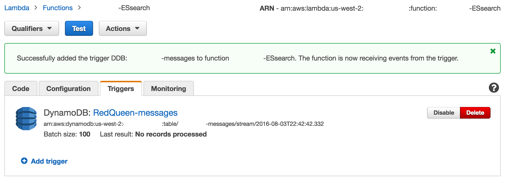

# Zombie Microservices Workshop: ラボガイド

## ワークショップの概要
[Zombie Microservices Workshop](http://aws.amazon.com/events/zombie-microservices-roadshow/)は[AWS Lambda](http://aws.amazon.com/lambda/)、 [Amazon API Gateway](https://aws.amazon.com/api-gateway/)、 [Amazon DynamoDB](https://aws.amazon.com/dynamodb/)、[Amazon Cognito](https://aws.amazon.com/cognito/), [Amazon SNS](https://aws.amazon.com/sns/)やその他のAWSサービスを使ったサーバレスアプリケーション開発の基本を紹介するものです。このワークショップでは、AWS Lambda Signal Corpsの新しいメンバーとして、ゾンビ・アポカリプスの間、サーバレスな生存者のコミュニケーションシステムの開発の完了を任されています。

このワークショップには、[CloudFormation](https://aws.amazon.com/cloudformation/)を通じて起動されるサバイバーチャットアプリのベースがあります。コミュニケーションシステムの機能拡張もしくは独自機能の追加のために、ラボ演習を完了させましょう！

ラボを開始するに先だって、アプリケーションのためのユーザ認証のセットアップを[Cognito User Pools](https://docs.aws.amazon.com/cognito/latest/developerguide/cognito-user-identity-pools.html)で終わらせておく必要があります。これはアプリケーションの準備を終わらせるために必要なステップです。

### 必須: Cognito User Poolsを用いた認証のセットアップ
このセットアップラボでは、Amazon Cognito User Poolsを用いてユーザ認証をサーバレスなサバイバーチャットアプリケーションに統合します。

### ラボ
本ワークショップにおけるラボはそれぞれが独立したセクションとなっており、それらのいくつか、もしくは全て、またお好みの順番で実施することを選べます。

* **Lab 1: タイピングインジケータ**  

    この演習では既にUIとバックエンドの実装があり、RESTfulなエンドポイントを提供するAPI Gatewayのセットアップ方法に焦点をあてます。チャットルームで現在タイピング中の生存者が誰かを表示するために、サバイバーチャットアプリケーションを設定します。

* **Lab 2: Twilioを用いたSMSとのインテグレーション**  

    この演習ではサバイバーチャットアプリケーションにSMSテキスト機能を統合するために[Twilio](http://twilio.com)を使います。ユーザがテキストメッセージをサバイバーチャットアプリケーションに送信できるようにするため、フリートライアルのTwilioの電話番号を設定します。APIでデータ変換を実行するために、API Gatewayでのマッピングテンプレートの活用を学びます。

* **Lab 3: Elasticsearchによる検索機能の追加**  

    この演習では、チャットメッセージを含むDynamoDBテーブルからストリームされたチャットメッセージをインデックス化するために使用されるアプリケーションにElastisearchクラスタを追加します。

* **Lab 4: Slackのインテグレーション**  

    この演習はサバイバーが自身のSlackアプリからサバイバーチャットにメッセージを送信できるようにするために、ポピュラーなメッセージングアプリである[Slack](http://slack.com)をチャットアプリケーションに統合します。

* **Lab 5: Intel Edison ゾンビモーションセンサー** (要IoTデバイス)

    この演習はIntel EdisonボードとGrove PIRモーションセンサを使用してチャットシステムにゾンビのゾンビのモーションセンサー検知機能を統合します。モーションの検知イベントを処理し、サバイバーチャットにプッシュするためにLambdaファンクションを構成します！

### ワークショップのクリーンアップ

このセクションではラボでの作業が完了したときに環境を削除するための手順を提供します。

* * *

### 始めましょう！CloudFormation Stackを起動してください
*スタックの起動の前に、起動されたリソースのうちいくつかは、ワークショップ終了時に手動で削除する必要があることに気をつけてください。作業が終わったら、マニュアルによる削除が必要とされるものを知っておくために”ワークショップのクリーンアップ”セクションを確認してください。*

1\. このワークショップを始めるため、 **以下の'Deploy to AWS'ボタンから使いたいリージョンのものを1つクリックしてください** 。これがこのワークショップの間、リソースを起動するAWSリージョンになります。これはあなたが選択したリージョンのAWSマネージメントコンソールでCloudFormationテンプレートを開きます。

Region | Launch Template
------------ | -------------
**N. Virginia** (us-east-1) | [](https://console.aws.amazon.com/cloudformation/home?region=us-east-1#/stacks/new?stackName=zombiestack&templateURL=https://s3.amazonaws.com/aws-zombie-workshop-us-east-1/CreateZombieWorkshop.json)
**Oregon** (us-west-2) | [](https://console.aws.amazon.com/cloudformation/home?region=us-west-2#/stacks/new?stackName=zombiestack&templateURL=https://s3-us-west-2.amazonaws.com/aws-zombie-workshop-us-west-2/CreateZombieWorkshop.json)
**Ireland** (eu-west-1) | [](https://console.aws.amazon.com/cloudformation/home?region=eu-west-1#/stacks/new?stackName=zombiestack&templateURL=https://s3-eu-west-1.amazonaws.com/aws-zombie-workshop-eu-west-1/CreateZombieWorkshop.json)
**Frankfurt** (eu-central-1) | [](https://console.aws.amazon.com/cloudformation/home?region=eu-central-1#/stacks/new?stackName=zombiestack&templateURL=https://s3-eu-central-1.amazonaws.com/aws-zombie-workshop-eu-central-1/CreateZombieWorkshop.json)
**Tokyo** (ap-northeast-1) | [](https://console.aws.amazon.com/cloudformation/home?region=ap-northeast-1#/stacks/new?stackName=zombiestack&templateURL=https://s3-ap-northeast-1.amazonaws.com/aws-zombie-workshop-ap-northeast-1/CreateZombieWorkshop.json)
**Singapore** (ap-southeast-1) | [](https://console.aws.amazon.com/cloudformation/home?region=ap-southeast-1#/stacks/new?stackName=zombiestack&templateURL=https://s3-ap-southeast-1.amazonaws.com/aws-zombie-workshop-ap-southeast-1/CreateZombieWorkshop.json)
**Sydney** (ap-southeast-2) | [](https://console.aws.amazon.com/cloudformation/home?region=ap-southeast-2#/stacks/new?stackName=zombiestack&templateURL=https://s3-ap-southeast-2.amazonaws.com/aws-zombie-workshop-ap-southeast-2/CreateZombieWorkshop.json)

*もし、CloudFormationの起動がFAILEDになる場合は、us-east-1 (Virginia)での起動をお試しください*

2\. リージョンを選択し、AWS CloudFormation Console内に入ったら、"Select Template"というタイトルの画面が表示されているはずです。あなたに代わってCloudFormationとテンプレートを提供していますので、青い**Next**ボタンをクリックして進めてください。

3\. 次の"Specify　Details"という画面で、スタックが"zombiestack"という名前で入力済みとなっています。**15文字以下**であなたが選択した名前にカスタマイズすることも、そのままにしておくことも可能です。パラメータのセクションでは、チームで開発したい場合やチームメートのアクセスを許可するIAMユーザを自身のアカウント内に作成したい場合、作りたいチームメート/ユーザの数を**NumberOfTeammates**というテキストボックスに入力してください。もしくは、デフォルトの0のままにして追加のユーザが作られないようにします。スタックを起動するユーザは既に必要な権限を持っています。**Next**をクリックします。

*もし、IAMユーザを作成する場合、IAMグループもまた作成され、それらユーザはグループに追加されているでしょう。スタックの削除で、これらのリソースは削除されます。*

4\. "Options"ページでは、デフォルトのままにして**Next**をクリックします。

5\. "Review"ページでは、 内容を検証し、一番下までスクロールして、スタックがIAMリソースを起動することに同意します。それから**Create**をクリックし、スタックを起動します。

6\. 起動には3分ほどかかります。また、その進捗は"Events"タブで追うことが可能です。作成が完了したときは、ステータスが"CREATE_COMPLETE"に変わります。

7\. CloudFormationの"Outputs"タブをクリックし、"MyChatRoomURL"のリンクをクリックします。新規タブでチャットアプリケーションが開きます。後ほど戻ってくるのでこのタブはそのままにしておきます。

Cognito User Poolの認証をセットアップするため、続けて次のセクションに進んでください。

## Cognito User Poolsを用いた認証のセットアップ（必須）

サバイバーチャットでは認証のために[Amazon Cognito](https://aws.amazon.com/cognito/)を使用します。Cognito Federated Identityを利用すれば、外部のアイデンティティプロバイダを通して認証することと、AWS内にあるアプリのバックエンドリソースやAmazon API Gatewayの背後にあるサービスへのアクセスのためのテンポラリのセキュリティクレデンシャルを提供することが可能になります。 Amazon CognitoはSAMLもしくはOpenID Connectをサポートする外部アイデンティティプロバイダ、（Facebook、Twitter、Amazonといった）ソーシャルアイデンティティプロバイダと連携し、独自のアイデンティティプロバイダと統合することも可能です。

Facebook、Googleやその他プロバイダといったサードパーティのプロバイダとのフェデレーションに加えて、Cognitoは[Cognito User Pools](https://docs.aws.amazon.com/cognito/latest/developerguide/cognito-user-identity-pools.html)と呼ばれる新しい組み込みのアイデンティティプロバイダも提供します。

CloudFromationを起動した際に、Coggnito Federated Identityは既に作成されています。

チャットアプリのユーザディレクトリとしてCognito User Poolsをセットアップし、Cognito Federated Identity Poolとともに有効な認証プロバイダとして構成します。API Gatewayは有効なAWSのパーミッションで署名されたリクエストのみを許可するようIAM認証で構成されています。ユーザがサバイバーチャットアプリ（User Pool）に正常にサインインすると、認証済みのユーザーのための一時的なAWSクレデンシャルを取得するようにCognito Federated Identity Poolに対してWebの呼び出しが行われます。これらのクレデンシャルはメッセージAPIに対する署名された[AWS SigV4](https://docs.aws.amazon.com/general/latest/gr/signature-version-4.html)HTTPリクエストの生成に使われます。


**始めましょう..**

1\. Cognitoのサービスコンソールに移動してください。


Cognito User Pools is not available in all AWS regions. Cognito User PoolsはAWSの全リージョンでは使えません。従って、**us-east-1 (Virginia), us-west-2 (Oregon), eu-west-1 (Ireland), or ap-northeast-1 (Tokyo)**以外のリージョンでCloudFormationスタックを起動したなら、マネージメントコンソール上部のナビゲーションバーを使ってAWSリージョンを切り替え、Cognitoを構成するために**us-east-1 (Virginia)**に移動してください。アプリケーションはCloudFormationテンプレートを起動したリージョンにホストされますが、Cognitoによる認証はus-east-1で行われます。CloudFomationスタックを上記にリストされたリージョンの1つで起動したならば、そのリージョンでは既にサービスは利用可能なので単にマネージメントコンソール内のCognitoサービスに移動してください。

Cognitoのサービスコンソール内に入ったら、**Manage your User Pools**という青いボタンをクリックしてください。チャットアプリケーションのユーザがアプリを使用するときに認証するユーザディレクトリをセットアップします。

2\. 右上の**Create a User Pool**という青いボタンをクリックしてください。新しいユーザディレクトリが作成されます。

3\. "Pool Name"テキストボックスで、ユーザプールに**[指定したスタック名]-userpool**と名前を付けてください。例えば、もしCloudFormationスタックを"sample"という名前にしたのであれば、あなたのユーザプールの名前は"sample-userpool"になります。User Poolに名前をつけたら、マニュアルセットアップを続行するため**Step through Settings** をクリックしてください。

4\. 属性のページで、**email, name, phone number**という属性に対して必須チェックボックスを選択してください。

* Cognito User Poolsではアプリケーションのユーザに紐付けたい属性を定義することが可能です。これらの値はアプリにサインアップした際にユーザから提供される値を表しています。Cognitoでユーザを認証すると、クライアントアプリに提供されたセッションデータの一部として、アプリケーションで利用可能です。

5\. "Add custom attribute"のリンクをクリックします。全てのデフォルトをそのままにし、ここに記載されている通り正確に**slackuser**といいう"Name"を入力します。追加のカスタム属性を2つ、**slackteamdomain**と**camp**を追加してください。

* User Pool内では、User Poolを作成するときに自分が定義するカスタム属性を指定することができます。ゾンビサバイバーチャットアプリのために3つのカスタム属性を含めます。

属性の設定が以下のイメージと一致しているはずです:


**Next Step**をクリックしてください。

6\. ポリシーのページでは、パスワードポリシーの設定をデフォルトのままにして**Next step**をクリックします。

7\. ベリフィケーションのページでは, 最初の2つのセクションはデフォルトのままにし、**Do you want to customize your email verification message?**というタイトルのセクションまでスクロールダウンしてください。

"Signal Corps Survivor Confirmation"というemailの件名を追加してください。メッセージ本文は変更しませんが、そこに独自のカスタムメッセージを追加することも可能です。Cognitoにサービスのemailアドレスからemailを送信するようにしますが、プロダクション環境では自身のメールサーバから検証メールを送信するようにCognitoを構成することも可能です。

**Next step**をクリックしてください。

* このアプリケーションではMFAを必要としません。しかし、サインアップにおいて、emailアドレスを通じた検証を必要としています。これは、"Do you want to require verification of emails or phone numbers?"でemailのチェックボックスが選択されていることでわかります。この設定で、ユーザがアプリケーションにサインアップしたとき、確認のためにアプリケーションに入力が必要とされるemailアドレスに対して確認コードが送信されます。

8\. Devicesのページでは、"No"が選択されたデフォルトのままにします。User Poolがユーザのデバイスを記憶するように構成しません。

9\. Appsページで、**Add an app**をクリックしてください。 **App Name** テキストボックスには"Zombie Survivor Chat App"と入力し、**client secretのチェックボックスは選択しないでください**。**Set attribute read and write permissions**をクリックしてください。アプリに対して作成したカスタム属性へのアクセスに"writable"権限を与える必要があります。**Writable Attributes**で**custom:slackuser、custom:slackteamdomainとcustom:camp**のチェックボックスを選択してください。 残りはデフォルトのままとし、**Create App**をクリックします。その後、**Next step**をクリックしてください。

10\. **Pre authentication**と**Post confirmation**トリガーのドロップダウンリストでは、"[指定したスタック名]-CognitoLambdaTrigger"という名前のLambdaファンクションを選択してください。**Next step**をクリックしてください。

* Cognito User Poolsでは、開発者がカスタムワークフローのロジックをサインアップとサインインのプロセスに埋め込むことが可能です。このカスタムワークフローのロジックはLambda Triggerとして知られるAWS Lambdaファンクションで表されます。

* この機能により、開発者は情報をLambdaファンクションに渡すことができ、サインアップ/サインインプロセスの異なるステージで呼び出すファンクションを指定することが可能です。そしてこれはサーバレスでイベントドリブンな認証プロセスを可能にします。

* In this applicationこのアプリケーションでは、2つのLambda Triggerを作成します。

    * Post-Confirmation: このトリガーはユーザがサインアップで正常に検証コードを送信し、確認済みユーザになった後に呼び出されます。このトリガーに紐付けられたLambdaファンクションはユーザによって提供された属性を取り、CloudFormationによって作られたDynamoDBのカスタムUsersテーブルにインサートします。これにより、アプリケーション内部からユーザ属性のクエリを実行可能になります。

    * Pre-Authentication: 生存者がウェブアプリケーションにサインインするたび、Cognitoへの認証のためにユーザの情報が送信されると、このトリガーは起動します。このLambda Triggerのためのコードは呼び出されたUser Poolから渡されてくるパラメータとしてユーザの属性を取得し、DynamoDBのUsersテーブルでユーザのレコードを更新するのに使っています。これにより最初のサインイン時にユーザのデータをDynamoDBにロードすることや、毎回ログインするように継続的にUser Poolsの値と現在のものを持つこともできます。

    * このワークショップでは、両方のトリガーに対して同じバックエンドのLambdaファンクションを使用します。呼び出しにおいて、ファンクションはどのようなタイプのイベント、Post-ConfirmationもしくはPre-Authenticationが発生したかチェックし、それに応じて正しいコードを実行します。

11\. User Poolの設定を確認して、**Create pool**をクリックしてください。もし正常にプールが作成されたら、プールの詳細ページへと戻ってくるはずです。

12\. コンピュータ上でテキストエディタを開いて、プールの詳細ページに表示されている"Pool Id"をその中にコピーしてください。それから左側のナビゲーションペインにある**Apps**タブをクリックします。**App client id** が表示されているのが見えるはずです。その**App client id**を同じようにテキストエディタにコピーします。

User Poolの設定が完了しました。ここで既に作成されているCognito Identity Poolとの連携をセットアップします。

* [Amazon Cognito Identity Pool](https://docs.aws.amazon.com/cognito/latest/developerguide/cognito-identity.html)が構成されています。アイデンティティプールはアプリ内部からAPIコールを行うために外部の連携ユーザにテンポラリのクレデンシャルをAWSから引受けます。

* 自分のアプリに認証用User Poolを作成しました。あなたのユーザは今はまだIAM認証されたAWS APIコールを行うためにアクセスする必要があります。

* Cognito Identity内で連携のセットアップをし、User Poolsを**Authentication Provider**として許可します。

マネージメントコンソールの上部ナビゲージョンバーで、以下に表示されているようにリンクをクリックして**Federated Identities**にスイッチしてください。


13\. 既に作成されているIdentity Poolをクリックします。"[指定したスタック名] _ identitypool"という名前になっているはずです。Identity Poolのダッシュボード上、右上の**Edit identity pool**を選択します。

14\. Cognito Ideneityを使うことで、認証済ユーザと未認証（ゲスト）ユーザの両方に対してアクセス権を提供することが可能です。ユーザのこれらのグループに関連付けられたパーミッションはこれらのCognito roleにアタッチしたIAM roleによって規定されます。Authenticated roleは本人が（Cognito認証済アプリケーションユーザ）サバイバーチャットアプリに関連付けられたAPI GatewayのエンドポイントARNに対して"execute-api:invoke"という呼び出しをする権限を与えるように構成されています。
* ユーザがアプリケーションで認証する際、彼らは認証済ユーザとなり、アプリケーションを使ってチャットメッセージをサバイバーチャットに送信することが可能になります。

15\. "Authenticated providers"というタイトルのセクションにある黒いドロップダウンの矢印をクリックしてください。Identity Poolをアイデンティティプロバイダ、自身のCognito User Poolからフェデレーテッドアクセスができるよう構成します。"Cognito" identity providerタブで、**User Pool ID**と**App Client ID**をテキストエディタファイルからそれぞれのテキストボックスに入力します。 テキストファイルは削除しないでください、これらの項目は後のステップで再度必要になります。

先にセットアップした際に自身のUser Poolからこれらをコピーしているはずです。コピーされたものがない場合、先に作成した自身のCognito User Poolに戻り、User Pool IdとApp Client IDを探してください。

ページの下までスクロールし、User Poolの設定を保存するため**Save Changes** をクリックします。自身のCognito User Poolは自身のアイデンティティプールとフェデレーションし、アプリ内で認証したユーザ用のテンポラリクレデンシャルを引き受けるようセットアップされています。

16\. サーバレスのJavaScriptアプリケーションがユーザをログインさせるためにUser Poolと通信できるようアプリケーションの設定ファイルをアップデートします。

**CloudFormationスタックを起動したリージョンの** Amazon S3のコンソールに移動します。

* もし、Cognitoの設定のためにリージョンを変更していた場合、スタックを起動したリージョンに戻して、S3に移動してください。


17\. Amazon S3バケットの一覧ページで、CloudFormationによって作成されたバケットを探してクリックします。スタック名が先頭に付与された名前になっているはずです。[指定したスタック名]-s3bucketforwebsitecontent"のように....

18\. このバケットはワークショップのLambdaファンクションのためのソースコードやCloudFormatioリソースと同様にサーバレスのJSアプリをホストするための全てのコンテンツを含みます。（プレフィックスが）"S3"と名付けられたフォルダをクリックし、**S3/assets/js/constants.js**というファイルをクリックしてください。

**S3/assets/js.constants.js**を自身のローカルマシンにダウンロードし、テキストエディタで開きます。


19\. constant.jsファイルを開き、"USER_POOL_ID"という変数にUser Pool IDをコピーします。それから、App Client IDを”CLIENT_ID”変数にコピーします。
これらは、以前から開いていたテキストファイルからコピーする必要があります。

* JSアプリケーションはワークショップの別サービスと通信するのに必要なランタイム変数を決定するためにこのファイルの値を使用します。

* アイデンティティプールのIDは、CloudFormationテンプレートが起動された際に他のいくつかの変数とともに自動的に埋められています。

20\. constants.jsファイルを保存し、S3にアップロードし直します。S3コンソールのウィンドウで、青い**Upload**ボタンをクリックし、自身のローカルマシンからconstants.jsファイルをアップロードします。 **"Set Details->SetPermissions"をクリックし、"Make everything public"というチェックボックスを選択してください**。それから**Start Upload**をクリックすると、古いconstantsのファイルを新しいファイルで上書きします。もともとダウンロードしたのと同じディレクトリにアップロードされ直していることを確認してください。

* これでアプリケーションはCognitoとやりとりするのに必要な設定を保持しました。

21\. CloudFomationの画面に戻り、チャットルームのURL（MyChatRoomURL）をCloudFormationスタックのOutputタブの中から見つけます。

* もし、既にアプリケーションがブラウザ内で開かれているならば、新しいconstants.jsをアプリでロードするためにページをリフレッシュしてください。

22\. ゾンビサバイバーウェブアプリのサインインページが見えるはずです。アカウントを作成する必要があるので、**Sign Up**をクリックします。

23\. フォームを埋めます。

* **Select your Camp**: あなたの生活する地域を指定してください！現在はこの属性はアプリケーション内では使われておらず、追加のチャレンジに取り組みたいもののために利用可能です！ワークショップが終わったとき、Appedixにあるチャネルチャレンジに挑戦し、取り組んでみてください。

* **Slack Username**: このワークショップのSlackの演習で使用するSlackのユーザ名を入力してください。これはSlackのユーザ名とサバイバーアプリのユーザアカウントを関連付けます。Slackの演習を実施したい場合は必須です。

* **Slack Team Domain Name**: Slackのユーザは多くのチームのメンバーになり得ます。サバイバーチャットアプリとインテグレーションしたいSlackチームのドメイン名を入力してください。SlackチームドメインとSlackユーザ名のコンビネーションは新規サバイバーチャットアプリアカウントと関連付けるユーザをユニークに識別します。

終わったら、**Sign Up**をクリックします。

24\. 確認コードを入力するよう求めるフォームが表示されます。サインアップに使用したemailアドレスの受信ボックスを確認してください。"Signal Corps Survivor Confirmation"という件名のemailを受け取っているはずです（Spamフォルダにあるかも知れません）。確認コードをコピーし、確認ウィンドウに入力します。


アカウントの確認後、クレデンシャルによってサインインし、チャットを開始します！

25\. メッセージは中央のチャットペインウィンドウに表示され始めます。チームメートにURLを自由にシェアしてください。自由にアカウントのサインアップをしてください、そしてグループとしてチャットを始めてください！もしこのソリューションを1人で構築している場合、異なるemailアドレスを用いて複数のユーザアカウントを作成することができます。その後、複数ユーザをシミュレートするため、異なるブラウザで両方のユーザアカウントにログインしてください。

**チャットアプリケーションのベースラインは設定され動いています！ まだ重要な機能が失われていて、the Lambda Signal Corpsはあなたにそれを作り上げてもらう必要があります。なので以下を始めてください！**

*このワークショップはAPI Gatewayのキャッシュを活用しません。AWSの無料枠でカバーされず、追加の課金が発生するのでこの機能はオフにした状態にしておいてください。これは本ワークショップでは不要です*

## Lab 1 - タイピングインジケータ

**この演習でやることは...**

このセクションでは、チャットルームでどの生存者がタイピング中なのかを表示する機能を作成します。これを有効にするため、新たに作成したLambdaファンクションとAPIを、どの生存者がタイピングしているかについての詳細を含むDynamoDBテーブルにタイピングのメタデータをプッシュするよう編集する必要があります。サバイバーチャットアプリは誰がタイピングしているかを決めるため、継続的にこのAPIエンドポイントをポーリングします。タイピングインジケータは以下のセクションのウェブチャットクライアントに表示されます。UIとバックエンドのLambdafなクションは実装されており、この演習ではAPI Gatewayの機能を有効にする方法に焦点をあてます。

アプリケーションは[CORS](http://docs.aws.amazon.com/AmazonS3/latest/dev/cors.html)を使用します。この演習は、CORSを有効化するのに必要なステップと同様にバックエンドのLambdaファンクションも結びつけます。

**タイピングインジケータのアーキテクチャ**


1\. メインのコンソールページからAPI Gatewayサービスを選択します。


2\. ゾンビワークショップのAPI Gatewayを選択

3\. /zombie/talkersリソース下の"GET"メソッドをクリックすることでこれを行います。これは以下のイメージで青にハイライトされています。


*このGET HTTPメソッドはサバイバーチャットアプリによって、どのユーザがタイピング中か決めるためのDynamoDBのtalkersテーブルに対して継続的なクエリを実行するために使われます。*

4\. **Integration Request** をクリックします。

5\. "Integration Type"で**Lambda Function.**を選択します。

* 現在、このAPIメソッドは"MOCK"インテグレーションに設定されています。MOCKインテグレーションは、テストや、バックエンドがまだ構築されていないけれどもAPIはサンプルのダミーデータを返す必要がある場合に便利なダミーのバックエンドです。MOCKインテグレーションを削除し、このGETメソッドをDynamoDBにクエリを行うLambdaファンクションに接続するよう構成します。

6\. **Lambda Region** フィールドでは、CloudFormationスタックを起動したリージョンを選択します（ヒント:CloudFormationテンプレートを起動するためにクリックした黄色いCloudFormationボタンに対応するリージョンコードを選択します。）。例えば、もしVirginia（us-east-1）で起動したならば、Lambda Regionとしてus-east-1を選択します。

* CloudFormationテンプレートを起動する際、選択したリージョン内でいくつかのLambdaファンクションも作成します。これにはチャットルームで現在どの生存者がタイピングしているかに関する詳細を持つDynamoDBの"Talkers"テーブルからデータを取得したり、入れたりするファンクションも含みます。

7\. **Lambda Function**フィールドで、テキストボックスに"gettalkers"と入力を始めます。自動入力のドロップダウンで、名前に"GetTalkersFromDynamoDB"を含むファンクションを選択します。**_[指定したスタック名]_**-GetTalkersFromDynamoDB-**_[XXXXXXXXXX]_**.**Lambda Function**というような感じになっているはずです。

* このLambdaファンクションはNodeJSで書かれています。DynamoDBのTalkersと呼ばれるテーブルへのGetItemリクエストを実行します。このtalkersテーブルは、チャットルームのユーザが入力するたびに継続的に更新されるレコードを含みます。GETメソッドにこのLambdaファンクションをフックすることによって、チャットアプリがAPIをGETリクエストでポーリングするときにAPI Gatewayによって呼びだされます。

8\. ポップアップがLambdaインテグレーションへとスイッチしたいということの確認をしてきた場合、青い**Save**ボタンを選択し、**OK**をクリックします。その後、"OK"を再度クリックすることでAPI GatewayにLambdaファンクションを呼び出すためにアクセスを許可します。この2つめのポップアップはAPI GatewayがLambdaファンクションを呼び出したいということを確認するものです。

9\. Method Execution FlowのMethod Responseセクションをクリックします。APIを公開するのにどのような種類のHTTPレスポンスタイプかをAPI Gatewayに伝えます。

10\. 200 HTTPステータスのレスポンスを追加します。"Add Response"をクリックし、ステータスコードのテキストボックスに"200"と入力し、そしてその後、以下の表示のようにMethod Response保存するために小さなチェックマークをクリックします。


* /talkersリソースのGETメソッドをHTTPステータス200でレスポンス可能なように構成しています。さらなるレスポンスタイプを追加できますが、このワークショップでは簡単にするためスキップします。

11\. 左のナビゲーションペインのリソースツリーで"POST"オプションをクリックすることで/zombie/talkers/POSTメソッドを選択します。


12\. GETメソッドで実施したようにステップ4から10をまた実行します。しかし、今回はIntegration RequestでLambdaファンクションを選択しているとき、自動入力で"writetalkers"をタイプし、**_[指定したスタック名]_**-WriteTalkersToDynamoDB-**_[XXXXXXXXXX]_**というようなファンクションを選択します。

* これらのステップでは、チャットルームで現在どの生存者がタイピングしているかに関する詳細を持つDynamoDBのTalkersテーブルにデータをインサートするためにチャットアプリに使われるPOSTメソッドを構成しています。GETメソッドで行ったように、POSTメソッドでもまったく同じ方法で設定を行っています。しかし、このPOSTメソッドは、データベースにデータを送信するために使用されるので、異なるバックエンドのLambdaファンクションをトリガーします。"GetTalkersToDynamoDB"ファンクションがDynamoDBからデータを取得するのに使用されている間に、このファンクションはDynamoDBにデータを書き込みます。

13\. /zombie/talkers/OPTIONSを選択します。

14\. Method Responseを選択します。

15\. メソッドレスポンスに200を追加します。"Add Response"をクリックして、ステータスコードテキストボックスに"200"と入力し、その後は、method resuponseを保存するために小さいチェックマークをクリックします。

16\. OPTIONSのMethod Flowに戻り、Integration Responseを選択します。（戻るには、Method Executionの概要画面に戻してくれる"Method Execution"というタイトルの青いハイパーリンクがあるはずです。

17\. Integration Responseを選択します。

18\. 200というメソッドのレスポンスステータスをIntegration responseに追加します。"Method response status" ドロップダウンをクリックして、"200"を選択します（正規表現のボックスは空白のまま）。終わったら青い**Save**をクリックします。

* このセクションでは、OPTIONSメソッドをシンプルにHTTPステータス200を返すように構成しました。OPTIONSメソッドはクライアントがそれらに関連付けられたメソッドと同じように利用可能であるAPIリソースに関する詳細を取得することができるようにシンプルに使われます。

19\. 左のナビゲーションツリーで/zombie/talkers リソースを選択します。


20\. "Actions"ボックスをクリックし、ドロップダウンで"Enable CORS"を選択します。

21\. "Enable and Yes to replace the existing values"をクリックします。以下のように、有効になったCORSオプションに対して、すべて緑のチェックマークが表示されるはずです。 


* すべて緑のチェックマークで表示されない場合は、Method ResponseセクションにはHTTPステータス200コードを追加するのを忘れている可能性があります。POST、GETとOPTIONSメソッドの概要セクションに戻り、Method Responseボックスで"HTTPステータス： 200"が表示されていることを確認します。

22\. "Actions"ボックスをクリックしてDeploy APIを選択します。  


23\. ZombieWorkshopStageというデプロイメントを選択し、Deployボタンを押します。

* このワークショップでは、"ZombieWorkshopStage"と呼ばれるステージにAPIをデプロイします。現実世界のシナリオでは、おそらく自身のAPIの開発プロセスの実際のステージと連携した"production"または"development"などのステージにデプロイします。

**LAB 1 完了**

入力すると、誰が入力したかをタイムスタンプとともにテーブルの継続的な更新のためにPOSTリクエストがTalkers DynamoDBテーブルに行われます。どの生存者が入力しているのかをチェックするため、そのテーブルに継続的なポーリング（GETリクエスト）も発生します。それはウェブアプリで"Users Typing"フィールドを更新します。


* * *

## Lab 2 - Twilioを用いたSMSとのインテグレーション

**この演習でやることは...**

このセクションでは、フリートライアルのTwilio SMS電話番号を作成します。自身のTwilioの番号に着信する全てのテキストメッセージをAPI Gatewayの/zombie/twilioというAPIリソースに転送するため、このTwilioの電話番号とwebhookを設定します。これで、テキストメッセージを介して、チャットルームでの生存者と通信できるようになります。

**SMS Twilioインテグレーションのアーキテクチャ**


1\. https://www.twilio.com/try-twilioでフリートライアルのアカウントにサインアップ。もしくは既にTwilioのアカウントを持っているのであればログインを。

2\. アカウントを作成したら、 Twilioコンソールにログインし、左側のナビゲーションペインのホームアイコンに移動します。ホーム画面/コンソールのダッシュボードでは、**Phone Numbers**セクションまでスクロールし、"Phone Numbers"をクリックします。


3\. Phone Numbersの画面で、自分のアカウントに電話番号を割り当てるには、"Get Started"をクリックします。それから、赤い"Get your first Twilio phone number"ボタンをクリックします。我々は、この演習で10桁の電話番号を生成しようとしていますがが、好みによってショートコードも動作します。この番号は、デフォルトでは、音声およびメッセージングのために有効にされています。ポップアップにあなたの新しい電話番号が表示され、"Choose this number"をクリックします。

*これらはUSの電話番号です。USの外でこのワークショップをしているのであれば、インターナショナルな電話番号もプロビジョニングできます。Twilioの契約条件および価格が適用されます。詳細は彼らのウェブサイトをご確認ください。*

4\. 電話番号を受け取ったら、左側ナビゲーションペインにある**Manage Numbers**ボタンをクリックします。電話番号をクリックすると、その番号のプロパティページが表示されます。

5\. プロパティページの下まで、Messagingのセクションまでスクロールします。**Configure With**ドロップダウンでは、**Webhooks/TwiML**を選択します。今はこのページは開きっぱなしにして次のステップへと進みます。

* Twilioのwebhookのセクションでは、サードパーティのサービスを使用して電話番号を統合することができます。このケースでは、 その番号に送られたメッセージをPOSTのHTTPリクエストで、API Gatewayのエンドポイントに全て転送するようにTwilioの電話番号を設定していきます。

6\. API Gatewayから**/zombie/twilio**というAPIのエンドポイントを取得します。そして、AWSにフックするようそのエンドポイントをTwilioに提供します。新しいタブでAWSマネージメントコンソールを開き、以下に図示されているようにAPI Gatewayに移動してください。セットアップを完了するために再度必要になるのでTwilioのタブは開いたままにしてください。


7\. API Gatewayのコンソールで、**Zombie Workshop API Gateway**というAPIを選択します。左側ナビゲーションツリーで、**Stages**をクリックします。


8\. "Stages"が選択された状態で、青い矢印をクリックして"Zombie Workshop Stage"を展開します。そして、**/zombie/twilio**リソースの**POST**を選択してください。**/zombie/twilio**リソースはCloudFormationがTwilioを使用したSMSインテグレーションのために作成したエンドポイントです。以下に示すように、**/zombie/twilio**リソースに表示されている**Invoke URL**が確認できます。


9\. **Invoke URL**をコピーして、Twilioのウェブサイトに戻ります。開いたままにしたTwilioのページでAPI GatewayのInvoke URLを**A message comes in**の隣のテキストボックスにペーストします。リクエストタイプが**HTTP POST**にセットされていることを確認してください。以下のようになります。


10\. TwilioをAPIに接続するセットアップを終了させるため、**Save**をクリックします。

11\. 受信したTwilioのメッセージを処理し、パースし、チャットサービスの"/messages"にプッシュするLambdaファンクションを作成します。始めるために、Lambdaコンソールに移動します。

* このワークショップを通してわかるように、私たちは標準化/フォーマットされたリクエストを/zombie/messageリソースへ送る前にデータの前処理するため別々のLambdaファンクションを利用します。これにより、それぞれDynamoDBとやりとりする複数のファンクションを書くよりは、/messageリソースの裏側にある既存のDynamoDBのロジックを複数回再利用できます。メッセージがTwilioの番号に来るように、 Twilioのwebhookは、バックエンドの前処理用Lambdaファンクションと統合される/zombie/twilioへのPOSTとしてそれらを転送します。このファンクションは、 Twilioのペイロードを取り除き、IAM認証を必要とする/zombie/messageサービスに対して、署名されたSigV4 HTTPS POSTを行う前にフォーマットします。

12\. **Create a Lambda function**をクリックし、全く新規のファンクションを作成するのでブループリント画面では**Skip**を選択します。Configure Triggers画面をスキップするため、 **Next**をクリックします。

13\. ファンクションに対して、**"[指定したスタック名]-TwilioProcessing"**のような、名前を作成します。"Runtime"は**Node.js 4.3**のままにしておきます。 Githubのリポジトリから**TwilioProcessing.js**ファイルを開きます。このファイルから内容全てをLambdaのコード入力セクションにコピーします。Lambdaにコードをコピーしたら、コード内で"API"という変数が定義されている[8行目](/Twilio/TwilioProcessing.js#L8)にスクロールします。API.endpointは"INSERT YOUR API GATEWAY URL HERE INCLUDING THE HTTPS://"という値が表示されているはずです。この文字列をAPI Gatewayで確認できる**/zombie/message**のPOSTメソッドのFQDNに置き換えてください。例えば、"https://xxxxxxxx.execute-api.us-west-2.amazonaws.com"のようになっているはずです。

**API.region**.という変数にリージョンコードも入れておいてください。これはCloudFormationを起動したリージョンになります。

最後に、作成済みのDynamoDBのUsersテーブルの名前をコピーします。これは**table**という変数に入れます。また、"phoneindex"という名前もコピーする必要があります（これはクエリをアシストするためにDynamoDBのテーブルに作成されたindexです）。これらの属性は、 CloudFormationのOutputセクションでわかります。CloudFormationから**DynamoDBUsersTableName**と**DynamoDBUsersPhoneIndex**に値をコピーする必要があります

* このワークショップは、多くのファンクションがNodejs 0.10で作成されていますが、コンソールでファンクションを作成する際に選択したNodeのバージョンに関係なく動作します。ワークショップはすぐにNodejs 4.3を使用するようアップグレード予定です。

14\. Lambdaのインラインコードコンソールにコードをコピーし、変数を編集したら、**Lambda function handler and role**セクションにスクロールします。**Choose an existing role**がドロップダウンから選択されているはずです。existing **role**には、**[指定したスタック名]-ZombieLabLambdaRole...**というような名前のロールを選択します。簡単にするために、ファンクション用に同じLambdaのロールを再利用しています。

15\. **timeout**フィールドを30秒に設定し、残りは全てデフォルトのままとします。それから**Next**、Reviewページで**Create function**をクリックしてLambdaファンクションを作成します。

* API Gatewayの/twilioエンドポイントへの入力からクエリ文字列のパラメータを受け取り、我々のチャットサービスのためにパラメータをJSONフォーマットへの変換も含む正しいフォーマットに変換し、最後に/zombie/messageへのHTTP POSTリクエストを実行するLambdaファンクションを作成しました。そのエンドポイントはDynamoDBのmessagesテーブルへのデータ追加を処理します。

16\. 今、あなたはTwilioProcessingファンクションを作成しているので、それを/zombie/twilioエンドポイントの**POST**メソッドに接続する必要があります。API Gatewayのコンソールに戻り、**/twilio**の下にある**POST**を選択します。

17\. "POST"の**Method Execution**画面で、/twilioリソースの"Integration Request"は**MOCK**というタイプが表示されているはずです。

18\. モックによるインテグレーションの代わりに、TwilioProcessingファンクションとインテグレーションするため、**Integration Request**を変更します。**Integration Request**をクリックします. Integration Requestの画面で、"Integration type"のラジオボタンを**Lambda Function**に変更します。"Lambda Region"のドロップダウンでは, TwilioProcessingのLambdaファンクションを作成したリージョン、CloudFromationスタックを起動したリージョンを選択します。 **Lambda Function**では, "TwilioProcessing"と入力すると、自動入力がファンクション名を表示します。 **TwilioProcessing**ファンクションを選択します。**Save**をクリックします。 ポップアップウィンドウでは、**OK**をクリックしてLambdaインテグレーションへとスイッチしたいことの確認をします。それから、**OK**をクリックして、ファンクションを呼び出すためにアクセス権を与えたいことに関して確認します。変更が保存されるまで数秒待ちます。

19\. **Save**をクリックした後、"POST"メソッドのMethod Executionページに戻ってきます。マッピングテンプレートを構成するため、**Integration Request**画面に戻ります。これにはMethod Execution画面で**Integration Request**をクリックします。

20\. Twilioは、"application/x-www-form-urlencoded"のcontent-typeで彼らのAPIからデータを送信しますが、Lambdaでは送信されてくるペイロードのパラメータ用にcontent-typeが"application/json"である必要があります。API Gatewayがパラメータを使用してバックエンドのTwilioProcessingファンクションを実行する前に、 着信メッセージのコンテンツタイプをJSONに変換するように、マッピングテンプレートを設定します。

21\. /twilioのPOSTメソッドのIntegration Request画面で、**Body Mapping Templates**セクションを展開し、**Add mapping template**をクリックします。"Content-Type"のテキストボックスには**application/x-www-form-urlencoded**と入力し、小さいチェックマークボタンをクリックして続けます。小さなチェックボックスをクリックしたら、指定したContent-Typeがマッチするリクエストのみを許可するかを確認するポップアップウィンドウが表示されます。**Yes, secure this integration**をクリックします。新しいセクションが画面の右側に**Generate Template**というドロップダウンとともに表示されます。ドロップダウンをクリックし、**Method Request Passthrough**を選択します。

22\. "Template"のテキストエディタウィンドウが表示されます。このセクションでは、入ってくるTwilioのデータをJSONオブジェクトへと変換するためのVTLの変換ロジックの一部を入力します。このテキストエディタで、**事前に入力されている内容を全て削除**し、以下のコードをエディタにコピーします。

```{"postBody" : "$input.path('$')"}```

エディタにコードをコピーした後、**Save**ボタンをクリックします。POSTメソッドを、/twilioエンドポイントに"application/x-www-form-urlencoded"というContent-TypeでPOSTリクエストが実行されると、入力データがJSONに変換されるようセットアップしています。これは以下のスクリーンショットのようになっているはずです。


23\. 入力メッセージをJSONに変換するためにIntegration Requestが設定されていますが、Twilio APIはレスポンスのContent-TypeとしてXMLを要求するので、Twilioに対して出て行くレスポンスをXMLフォーマットに変換するためIntegration Responseを設定する必要があります。サバイバーチャットサービスにSMSメッセージを送信するとき、あなたのメッセージが正しく受信されたことの確認メッセージとともにTwilioの電話番号に戻りの応答をできるようにするため、このステップが必要です。

24\. twilioのPOSTメソッドのMethod Execution画面に引き返します。/twilioのPOSTメソッドの"Method Execution"画面上で、**Integration Response**をクリックします。"Integration Response"画面で、method responseのセクションを展開するため黒い矢印をクリックします。**Body Mapping Templates**セクションを展開します。"application/json"というContent-Typeが確認できるはずです。JSONではなくXMLのContent-Typeが必要なので、**小さな黒いマイナスのアイコンをクリックしてこのContent-Typeを削除します**。そして、ポップアップウィンドウで**Delete**をクリックします。

25\. Integration Requestセクションに対して、前のステップでやったのと同じように**Add mapping template**をクリックします。

26\. "Content-Type"のテキストボックスで、**application/xml**を入力し、小さな黒いチェックマークをクリックして続けます。以前にやったのと同じく、JSONからXMLにレスポンスデータを変換するため、VTLのマッピングロジックをコピーします。この結果、/twilioのPOSTメソッドは、 XML形式でリクエストに応答することになります。新しくcontent-typeを作成した後、新しいセクションが画面の右側に**Generate Template**というドロップダウンとともに表示されます。そのドロップダウンをクリックし、**Method Request Passthrough**を選択します。テキストエディタで、既にあるコードを削除して、以下をエディタにコピーします。

```
#set($inputRoot = $input.path('$'))
<?xml version="1.0" encoding="UTF-8"?>
<Response>
    <Message>
        <Body>
            $inputRoot
        </Body>
    </Message>
</Response>
```

グレーの"Save"ボタンをクリックして続けます。

結果は以下のスクリーンショットのようになっているはずです。


27\. それから、上にスクロールして、画面上の青い**Save**ボタンをクリックします。最後に、API Gatewayコンソールの左側にある**Actions**ボタンをクリックし、APIをデプロイするため**Deploy API**を選びます。Deploy APIウィンドウでは、ドロップダウンから**ZombieWorkshopStage**を選択し**Deploy**をクリックします。

28\. APIとTwilioのインテグレーションをテストする準備が整いました。自身のTwilioの電話番号にテキストメッセージを送信します。

**LAB 2 完了**

インテグレーションが成功した場合、確認レスポンスのテキストメッセージを受け取るはずで、あなたが送ったテキストメッセージがウェブアプリのチャットルームにTwilioの電話番号からの入力として表示されるはずです。API GatewayとTwilioのテキストメッセージ機能が正しくインテグレーションされました。

* * *

## Lab 3 - Elasticsearch Serviceを用いたチャットメッセージの検索

**この演習でやることは...**

この演習では、Elasticsearch Serviceのクラスタを起動し、将来のメッセージのアドホック分析のためにチャットメッセージをElasticsearchに自動的にインデックスするようDynamoDB Streamsをセットアップします。

**Elasticsearch Serviceのアーキテクチャ**


1\. Amazon Elasticsearchアイコンをメインのコンソールページから選択します。

2\. 新規にAmazon Elasticsearchのドメインを作成します。"[指定したスタック名]-zombiemessages"と名前を付けてください。 **Next**をクリックします。

3\. **Configure Cluster**ページは、デフォルトのクラスタセッティングのままにして**Next**をクリックします。

4\. アクセスポリシーでは、**Allow or deny access to one or more AWS accounts or IAM users**をドロップダウンから選択し、アカウントIDを入力します。例のセクションで実施にAWS Account IDが提供されているので、コピーしてテキストボックスにペーストします。"Effect"のドロップダウンでは**Allow**が選択されていることを確認してください。**OK**をクリックします。

5\. ドメインのレビューページへと進むために**Next**を選択します。

6\. レビューページでは、**Confirm and create**を選択してElasticsearchクラスタを作成します。

7\. Elasticsearchクラスタの作成には10分ほどかかります。

* Elasticsearchクラスタを起動するには、およそ10分かかるので、先に進まず起動を待つこともできますし、Lab4に進んでクラスタの準備ができたときに、戻ってきてこの演習を完了させることも可能です。

8\. クラスタが開始されたら、エンドポイントをメモしておいてください。Lambdaファンクションで必要になります。


9\. マネジメントコンソールでLambdaを選択して、Lambdaのページに移ります。

10\. **Create a Lambda Function**を選択します。

11\. 右下のSkipボタンを選択してブループリントのセクションをスキップします。

12\. **"[指定したスタック名]-ESsearch"**のようにファンクション名を与えます。ランタイムはNode.js 4.3のままにします。お好みでこのファンクションの説明をセットすることもできます。

13\. 提供されているZombieWorkshopSearchIndexing.jsファイルからコードをペーストします。 これはGithubレポジトリの"ElasticsearchLambda"フォルダにあります。

14\. 提供されたコードの[6行目](/ElasticsearchLambda/ZombieWorkshopSearchIndexing.js#L6)で、**region**を作業中のリージョンコードに置き換えます（スタックを起動したリージョン、Lambdaファンクションを作成したリージョン）。

続いて、7行目で**ENDPOINT_HERE**という値の**endpoint**という変数をステップ8で作成したElasticsearchのエンドポイントに置き換えます。 **ペーストしたエンドポイントがhttps://で始まっていることを確認してください**.

* この手順は、クラスタのエンドポイントを参照するためのアクセス権を持つ前に、クラスタが作成完了し、"Active"状態である必要があります。

15\. LambdaファンクションにIAM roleを追加します。Roleで（この項目を見るためにはLambdaでConfigurationタブに移動する必要があるかも知れません）、roleのドロップダウンで**DynamoDB event stream role** クリックして新たにDynamoDBイベントストリームロールを作成します。roleを作成することの確認を行う新しいページが開きますので、**Allow**をクリックして進めます。

16\. Lambdaファンクションの"Timeout"フィールド（この項目はConfigurationタブのAdvanced Settingsに移動する必要があるかも知れません）で、ファンクションのタイムアウトを**1**分に変更します。Lambdaがタイムアウトする前にメッセージのバッチが処理されるようにします。他は全てデフォルトのままにしておきます。**Next**を選択し、Reviewページで**Create function**を選択してLambdaファンクションを作成します。

17\. 作成した新しい**"[指定したスタック名]-ESsearch"**というファンクションの"Event Sources"タブを選択します。

18\. **Add event source**を選択します。

19\. DynamoDBのイベントソースタイプを選択し、**messages**のテーブルを選択します。これは**"[指定したスタック名]-messages"**として表示されているはずです。残りはデフォルトのままにしておきます。

20\. 作成後、以下のスクリーンショットと同様のイベントソースが確認できるはずです。


21\. 上記のステップで、テーブルへの入力メッセージをキャプチャし、ElasticsearchクラスタへプッシュするLambdaファンクションをトリガーするために[DynamoDB Streams](http://docs.aws.amazon.com/amazondynamodb/latest/developerguide/Streams.html)を構成しました。

22\. 先にLambdaファンクション用に選択した"lambda_dynamo_streams"というroleは現時点ではElasticseatchクラスタへの書き込み権限を持っていません。今からそれを設定します。

23\. AWSマネジメントコンソールで[Identity and Access Management](https://console.aws.amazon.com/iam/)に移動します。このサービスのアイコンはグリーンで、"Security & Identity"セクションの下にリストされています。

24\. Identity and Access Managementのコンソールで**Roles**のリンクを選択します。

* [IAM Roles](http://docs.aws.amazon.com/IAM/latest/UserGuide/id_roles.html)は、ユーザと同様に、それに紐付けた権限を持ちます。 これは、さまざまなエンティティに与えられるアクセス権が何かを定義することができます。RolesはEC2インスタンス、Lambdaファンクションとその他アプリケーションやサービスによって引き受けられます。

25\. Roles画面の"Filter"というテキストボックスで、**lambda_dynamo_streams**と入力し、roleをクリックします。これは先程Lambdaファンクションにアサインしたroleです。

26\. "oneClick_lambda_dynamo_streams_xxxxxxxxxx"と同じようなポリシーのある"Inline Policies"のセクションにスクロールします。ポリシーを編集するため、**Edit Policy**をクリックします。インラインポリシーの内容を全て削除して、以下のポリシーブロックに置き換えます。

```
{
    "Version": "2012-10-17",
    "Statement": [
        {
            "Effect": "Allow",
            "Action": [
                "lambda:InvokeFunction"
            ],
            "Resource": [
                "*"
            ]
        },
        {
            "Effect": "Allow",
            "Action": [
                "dynamodb:GetRecords",
                "dynamodb:GetShardIterator",
                "dynamodb:DescribeStream",
                "dynamodb:ListStreams",
                "logs:CreateLogGroup",
                "logs:CreateLogStream",
                "logs:PutLogEvents",
                "es:*"
            ],
            "Resource": "*"
        }
    ]
}
```

27\. **Validate Policy**ボタンをクリックし、"The Policy is valid"という正常メッセージが帰ってくることを確認します。それから**Apply Policy**を選択して保存します。

* コピーした新しいポリシーには、Amazon Elasticsearch Serviceの全てのアクションを許可する```es:*```という新たなAllowアクションを含みます。プロダクションでは、Lambdaが特定のESドメインのみとやりとりするように全てのES clusterの代わりに作成したクラスターの実際のARNを指定することを推奨します。

28\. 代わりのIAM権限で、この時点からチャットに投稿されたメッセージはElasticsearchにインデックスが作成されます。チャットにいくつかのメッセージを投稿してください。メッセージがElasticsearchサービスのコンソールでクラスタの"Indices"セクションにインデックスされていることが確認できるはずです。


**LAB 3 完了**

クラスタとともに提供されているKibenaのWeb UIでメッセージの探索と検索を行いたい場合は、作成したElasticsearchドメインに移動した上でパーミッションを変更する必要があります。現在は自身のAWSアカウントのみアクセス権を持ったパーミッションが設定されています。これによりLambdaファンクションがクラスタにメッセージをインデックスすることができます。

チャートの作成やインデックスの検索をするためにWeb UIを利用するには、自身のコンピュータ/ラップトップ/ネットワークをホワイトリストするためにIPベースのポリシーを実装する、もしくはもっとシンプルに全員にアクセスを許可するよう選択する必要があります。ESクラスタのアクセスポリシーの編集方法の手順は、[こちらのドキュメント](http://docs.aws.amazon.com/elasticsearch-service/latest/developerguide/es-gsg-configure-access.html)を参照ください。全員にアクセス権をオープンにすることを選択する場合、誰でもメッセージを見ることができるということに気をつけてください。従って、Kibenaを試すのが終わった際は、AWSアカウントへの限定されたアクセス権に戻すようにしてください。もしくはシンプルにESクラスタを削除してください。

* * *

## Lab 4 - Slackのインテグレーション

**この演習でやることは...**

この演習では、Slack channelとサバイバーチャットをインテグレーションします。異なるチャットシステムを使っている生存者がいるかもしれず、彼らとコミュニーケーションを取りたいと思います。この演習が終わると、Slackでコミュニケーションしている生存者は、Slack channel内の生存者に対して送りたいメッセージにプレフィックスとしてスラッシュコマンドを設定することでゾンビチャットアプリの生存者に対してメッセージを送信できます。Slackユーザはスラッシュコマンドとともにメッセージを入力すると、Twilioの演習で有効にしたwebhook機能と同様にサバイバーチャットのAPIにメッセージが渡されます。

Slackに馴染みのないかたにお伝えすると、Slackは人気のある、特に開発者コミュニティの間で人気のフリーのチャットコミュニケーションサービスを提供しています。Slackは異なるチャットルームを区別するために"Channels"と呼ばれるコンセプトを用いています。詳細は彼らのウェブサイトを参照ください。

**Slackインテグレーションのアーキテクチャ**


1\. [http://www.slack.com](http://www.slack.com)に行き、teamとusernameを作成します。

2\. Slackにログインしたら、[https://slack.com/apps](https://slack.com/apps)に移動し、ページ上部にある**Build your own**をクリックしてください。それから次の画面では**Make a Custom Integration**を選択してください。

3\. "Custom Integration"ページで、スラッシュコマンドを作成するため**Slash Commands**を選んでください。スラッシュコマンドを用いると、webhookを用いてメッセージを外部のソースに転送するようSlackに伝えるコマンドを定義することができます。今回の場合、スラッシュコマンドを外部のURL（API GatewayエンドポイントのURL）に対してPOSTリクエストを行うよう構成します。

4\. Slash Commandsのページで、**Commands**というテキストボックスでコマンドを定義します。スラッシュコマンドとして**/survivors**と入力してください。その後、"Add Slash Command Integration"を選択して保存してください。

5\. Integration Settingsページの、**Method**セクションがドロップダウンから"POST"を選択済みとなっていることを確認してください。その後、**Token**セクションまでスクロールし、後続のステップで必要となるのでトークンをテキストファイルにコピー（もしくは新しいものを生成）します。

6\. Slackのブラウザタブを開いたままにして、別のタブでAWSマネージメントコンソールのLambdaサービスに移動してください。

7\. **Create a Lambda function**をクリックします。受信したSlackメッセージをパースして、チャットサービスに送るためのLambdaファンクションを作成します。

8\. ブループリントは使わないのでスキップしてください。**Next**を選択してトリガーのページもスキップしてください。

9\. ファンクションに**"[指定したスタック名]-SlackService"**という名前をつけます。Node.jsのバージョンについて、デフォルトのNode.js 4.3が選択されたままにします。このワークショップのGithubレポジトリもしくは、ローカルマシンにダウンロードしたGithubのファイルの場所に移動します。

10\. Githubリポジトリから、slackフォルダにある**SlackService.js**ファイルを開きます。このjsファイルの中身全てをLambdaのインラインエディタにコピーします。

11\. 先ほどファンクションにコピーしたものにSlack Tokenを入力します。Lambdaファンクションの[15行目](/Slack/SlackService.js#L15)にある"token"という変数にSlackからToken文字列をコピーし、**INSERT YOUR TOKEN FROM SLACK HERE**という文字列を自身のトークンで置き換えます。

* Slackは、インテグレーションに紐付いたユニークなトークンを提供します。検証という形でLambdaファンクションにこのトークンをコピーしています。Slackからの受信リクエストがAPIエンドポイントに送られ、LambdaファンクションがSlackのペイロードとともに呼び出されたら、Lambdaファンクションはリクエスト内の受信トークンがコード内に用意したトークンと一致するかを確認するためにチェックします。トークンが一致しない場合、Lambdaはエラーを返し、リクエストを処理しません。

12\. SlackからのメッセージとともにHTTPリクエストが送られるので"API"という変数にHTTPSチャットサービス（/zombie/message）のAPI Gatewayリソースに対するFQDNをインサートします。**API.endpoint**は[9行目](/Slack/SlackService.js#L9)に"INSERT YOUR API GATEWAY FQDN HERE INCLUDING THE HTTPS://"という値で表示されています。この文字列を**/message POSTメソッド**のFQDNで置き換えます。コードにインサートされている最終的なFQDNは"https://xxxxxxxx.execute-api.us-west-2.amazonaws.com"のようになっているはずです。

**API.region**という変数にリージョンコードも埋めてください。CloudFormationを起動したリージョンになります。

最後に作成済みのDynamoDBのUsersテーブルの名前をコピーします。これは**table**という変数に入れます。"slackindex"（これはクエリを支援するためにDynamoDBテーブルに作成されているインデックスです）という名前もコピーする必要があります。これらの属性はCloudFormationのOutputセクションで見つけることができます。**DynamoDBUsersTableName**と**DynamoDBUsersSlackIndex**の値をCloudFormationからコピーします。

* コードはリクエストと一緒に送られてきたトークンがSlackインテグレーションのためのトークンと一致しているかを確認するよう構成されています。もしそうなら、ユーザに関連づけられたSlack UsernameとSlack Team Domainを検証するためDynamoDB Usersテーブルを検索します。もしこれらの値がUsersテーブルのユーザとマッチしたら、メッセージは登録済み生存者からのものとして認可されます。Slackメッセージのペイロードをパースし、**/message**エンドポイントにSlackからのメッセージとともにHTTPSリクエストを行います。

13\. Lambdaのインラインコードコンソールにコードをコピーして、変数を編集したら、**Lambda function handler and role**セクションまでスクロールします。roleとしては、ドロップダウンから**Choose an existing role**を選択し、**[指定したスタック名]-ZombieLabLambdaRole...**といったroleを選択します。簡単にするために、ファンクションにたいして同じLambda用roleを再利用しています。

14\. Advanced Settingsで、**Timeout**を**30**秒にセットします。 それから**Next**をクリックします。

15\. Reviewページで、全てが正しいか確認してください。

16\. **Create function**をクリックします。Lambdaファンクションが作成されます。

17\. ファンクションが作成されたら、AWSマネジメントコンソールのAPI Gatewayサービスに移動します。"Zombie Workshop API Gateway"というAPIをクリックします。左側のリソースペインで、選択するために"/zombie"リソースをクリックしてハイライトさせます。それから**Actions**ボタンを選択し、 "Create Resource"を選びます。リソースネームとして、**slack**と入力し、Resource Pathとして**slack**と入力します。"Create Resource"をクリックして、SlackのAPIリソースを作成します。SlackのAPI用のこの最後のリソースは以下のように表示されます。


* このステップで、Slackのスラッシュコマンドwebhookがリクエストを転送するための新しいAPIリソースを作成しています。次のステップで、Lambdaファンクションをトリガーするこのリソースに紐付けたPOSTメソッドを作成します。正しいスラッシュコマンドとともにSlackでメッセージを入力すると、Slackはペイロードを前処理して、DynamoDBにデータをインサートするために/zombie/messageエンドポイントを呼び出すSlackServiceのLambdaファンクションを呼び出すこのリソースに対してリクエストを送ります。

18\. 新規に作成した"/slack"リソースで、これをハイライトし、**Actions**をクリックして/zombie/slackリソースに対する**POST**メソッドを作成するために**Create Method**を選択します。ドロップダウンでは**POST**を選択します。POSTメソッドを作成するため、チェックマークをクリックします。セットアップのページでは、**Lambda Function**というIntegration Typeを選びます。そして、リージョンのドロップダウンで自身が作業中のリージョンを選択します。Lambdaファンクションのフィールドでは、Lambdaファンクションの名前に"SlackService"と入力してください。ファンクション名が自動入力されるでしょう。**Save**をクリックしてから確認のために**OK**をクリックします。

19\. /slackのPOSTメソッドの**Integration Request**をクリックします。Slackから受信したクエリ文字列パラメータをパラメータとしてLambdaが要求するフォーマットであるJSONに変換するためのマッピングテンプレートを作成します。このマッピングテンプレートは受信するSlackメッセージが正しいフォーマットに変換されるようにするために必要となります。

20\. **Body Mapping Templates**の矢印を展開し、**Add mapping template**をクリックします。Content-Typeのボックスで、**application/x-www-form-urlencoded**と入力して小さなチェックマークをクリックして続けます。インテグレーションをセキュアにしたいか尋ねるポップアップが表示されたら、**Yes, secure this integration**をクリックします。これは定義されたcontent-typeのリクエストのみが許可されること確実にします。

Twilioの演習でやったように、リクエストをJSONに変換するためVTLのマッピングロジックをコピーします。新しいセクションが画面の右側に**Generate Template**というドロップダウンとともに表示されます。そのドロップダウンをクリックして、**Method Request Passthrough**を選択します。

テキストエディタで、存在するVTLのコードを全て削除し、以下をエディタにコピーしてください。

```
{"body": $input.json("$")}
```

グレーの**Save**ボタンをクリックして続けます。以下のスクリーンショットのような結果になります。


21\. API Gatewayコンソールの左側にある**Actions**ボタンをクリックして、APIをデプロイするため**Deploy API**を選択します。Deploy APIのウィンドウではドロップダウンから**ZombieWorkshopStage**を選択し、**Deploy**をクリックします。

22\. ナビゲーションツリーの左側で、ZombieWorkshopStageのツリーを展開し、**/zombie/slack**の**POST**メソッドをクリックします。以下のようにそのリソースのInvoke URLが表示されていることが確認できます。


23\. Invoke URL全体をコピーします。Slack.comのウェブサイトに戻り、スラッシュコマンドのセットアップページでたった今コピーしたSlackのAPI GatewayのInvoke URLを"URL"テキストボックスに入力します。"HTTPS://"を含むURL全体をコピーしたことを確認してください。スラッシュコマンド画面の下までスクロールし、**Save Integration**をクリックします。

24\. スラッシュコマンドのインテグレーションをテストする準備が整いました。自身のSlackアカウントのチームチャットチャネルで、"/survivors"というスラッシュコマンドに続けてメッセージを入力してください。例えば、"/survivors Please help me I am stuck and zombies are trying to get me!"と入力します。送信後、以下のようなSlack Botからの確認のレスポンスメッセージが表示されます。


**LAB 4 完了**

ゾンビサバイバーチャットアプリに移動すると、Slackからのメッセージが表示されているはずです。チャットアプリにメッセージを送信するようSlackを構成しました！


**ボーナスステップ**

メッセージをゾンビサバイバーチャットアプリに転送するようSlackを構成しました。しかし、チャットアプリに送られたメッセージをSlackチャットに表示させられますか？（例えば逆向きにです）試してみるか、演習の残りが終わったときに後ほど戻ってきて試みてみてください。HINT: ユーザがチャットアプリにメッセージを送るとSlack Webhookに対するPOSTリクエストを実行するようLambdaのコード設定を変更するとともにSlackの"Incoming Webhooks"インテグレーション機能を構成したいでしょう！

* * *

## Workshopのクリーンアップ

1\. 環境を綺麗にするために、CloudFormationスタックを削除する前に演習で作成したマニュアルのリソースを最初に削除することを推奨します。スタック削除を止めるようなリソースの依存があるかも知れないためです。

2\. TwilioProcessingのLambdaファンクションを必ず削除してください。もし、Twilioを使う予定がないのであればTwilioのフリートライアルアカウントとプロビジョニングした電話番号を削除してください。

3\. ElasticsearchクラスタとElasticsearchの演習で作成した関連Lambdaファンクションを必ず削除してください。

4\. Slackの演習で作成したLambdaファンクションと作成したSlack APIリソースを必ず削除してください。Slackのアカウントが不要なのであればSlackも削除してください。

5\. 必ずSNSトピック（作成した場合）とゾンビセンサーの演習で作ったLambdaファンクションを削除してください。

6\. 演習のセットアップで作成した、アプリケーションに関連付けられたCognito User PoolsとIdentity Poolを削除します。

* User Pool: 対象のUser Poolをクリックして、"Delete pool"ボタンをクリックし、User Poolを削除します。

* Identity Pool: CognitoのFederated Identitiesページに移動して自身のIdentity Pool([指定したスタック名]-identitypool)を見つけます。次に**Edit identity pool**をクリックします。ページ下部にスクロールしてIdentity Poolを削除します。

7\. CloudWatch Logsに移動して、不要なLog Groupがあれば削除します。

8\. これらのリソースを削除したら、CloudFormationコンソールに移動して、ワークショップの最初で起動したスタックを探し、選択した上で**Delete Stack**をクリックします。

* スタックが正常に削除されると、アクティブなスタックのリストには何も表示されません。スタックの削除に何か問題が発生したときはワークショップのインストラクタに教えてください。もしくはさらなるサポートを受けるために[AWS Support](https://console.aws.amazon.com/support/home)にコンタクトしてください。

* * *

## Appendix

* Channel Challenge: 現在、サバイバーアプリに送られた全てのメッセージは'default'のチャネルとしてデータベースに保存されます。全ての生存者はこれらのメッセージを閲覧可能です。あなたの挑戦は、同じ"Camp"にいる生存者にだけ表示するようメッセージのスコープの選択肢を持つようアプリケーションを編集することです（Campはユーザアカウントのサインアップ時にユーザから収集する属性です）。既存の'channel'属性の代わりに"Camp"属性で機能するように、バックエンドのメッセージ用データベースとLambdaファンクションそしてJSアプリケーションを変更する必要があります。